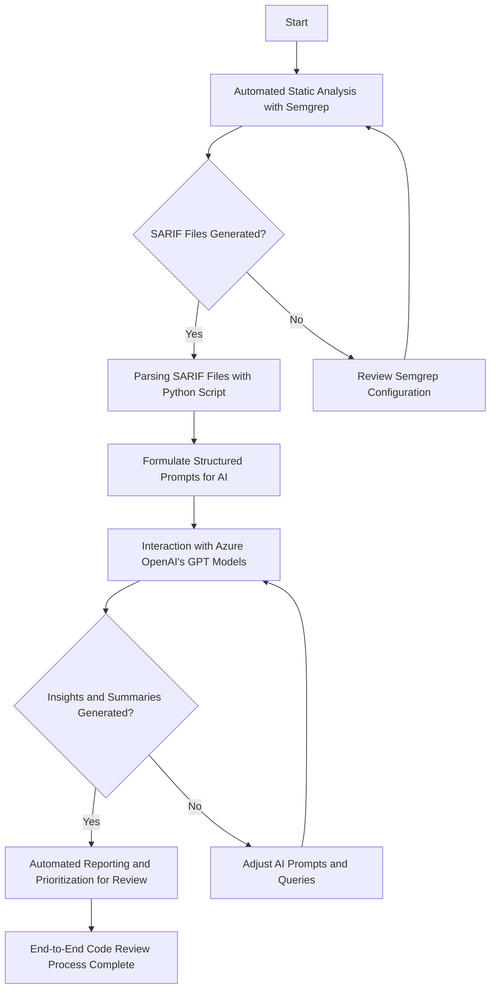
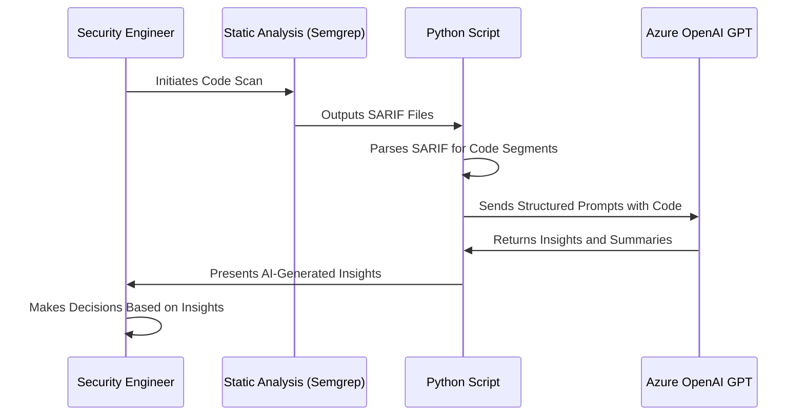
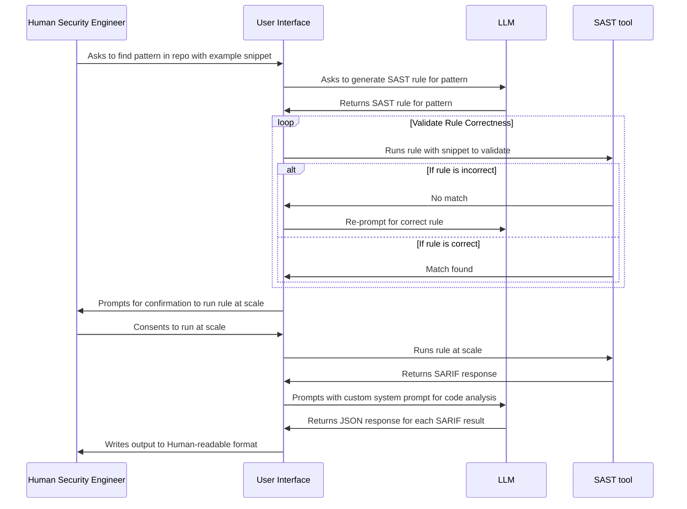

# Abstract
In the modern SecDevOps paradigm, the code review process plays a pivotal role in ensuring the quality and security of software applications. However, traditional manual code review methods are increasingly challenged by the scale and complexity of modern software projects, leading to bottlenecks and potential oversights in identifying critical issues. This paper introduces a novel automated code review system that integrates static analysis tools with advanced Generative Artificial Intelligence (AI) technologies to address these challenges. By leveraging static analysis tooling and generative AI models for intelligent code summarization and analysis, my approach aims to significantly enhance the efficiency, scalability, and effectiveness of code reviews. I present a proof-of-concept implementation that demonstrates the feasibility and potential impact of my solution, highlighting its ability to expedite the code review process while maintaining a high level of analytical quality. Preliminary results from internal trials at Microsoft indicate the system's capability to identify code patterns and potential issues that would likely be overlooked in manual reviews especially at scale, showcasing its effectiveness as a force multiplier in the code review process. Despite current limitations, my findings suggest a promising avenue for redefining static application security testing (SAST) and enhancing software development practices. This paper discusses the methodology, implementation, results, and future directions of our work, contributing valuable insights to the ongoing discourse on leveraging AI for software quality assurance.
# The Challenge of Code Review in Modern Software Development
In the realm of software development, particularly within large-scale projects, the process of code review is both critical and challenging. Manual code reviews, while necessary, are time-consuming and often become bottlenecks in the development process. Moreover, the complexity and volume of code in large projects make it impractical for human reviewers to identify all potential issues effectively. There is a pressing need for an automated solution that can perform code reviews at scale without sacrificing depth or quality of analysis.
# Automating Code Review: A Hybrid Approach
In response to the challenges outlined in the problem statement, my proposed solution is an automated code review system that integrates static analysis with advanced Generative AI capabilities. This system is designed to address the scalability and efficiency issues inherent in traditional human code review processes, particularly for large-scale software development projects. 

The solution comprises two key technological components: static analysis tooling to identify relevant code segments, and the application of Large Language Models (LLMs) for in-depth code analysis and summarization. Here's how the proposed solution works:
1. **Automated Static Analysis**: The first step involves leveraging a static analysis tool, to scan software codebases across multiple source code repositories of interest. A SAST tool is configured to identify specific code patterns implemented, that are of interest based on predefined rules. This step is crucial for efficiently sifting through vast amounts of code to focus on segments that require further analysis. The results of this analysis are exported in a format suited for further programmatic parsing.
2. **Integration with Generative AI**: The output files generated by the static analysis tool serve as input for the next phase of the process, where Generative AI comes into play. GenAI models are queried with structured prompts that include the class/method bodies containing code of interest, and any relevant context or questions about the code. Thanks to the LLMs' proficiency in parsing formatted text in prompts, they can effectively process these prompts and generate insightful analyses and summaries of the code. 
3. **Scalable and Insightful Code Review**: The combination of static analysis with the analytical prowess of Generative LLMs creates a powerful tool for code review. This system can analyze and summarize code at a scale and speed that far exceeds what is possible with manual review processes. By automating the identification and initial analysis of code segments, the system allows human reviewers to focus their efforts on addressing the most critical issues identified by the system.

A flowchart that captures this end-to-end process is below.


By addressing the limitations of traditional code review processes with this automated, AI-powered solution, I aim to significantly enhance the efficiency, scalability, and effectiveness of code reviews, ultimately leading to higher quality software development outcomes.
## Demonstrating Feasibility: A Proof-of-Concept Implementation
The current Minimum Viable Product (MVP) implementation of the automated code review system is designed to demonstrate the feasibility and potential impact of integrating static analysis with Generative AI for scalable code review processes. This implementation focuses on leveraging Semgrep for static analysis and Azure OpenAI's GPT models for intelligent code analysis and summarization. Here is an overview of the MVP implementation:
1. **Static Analysis with Semgrep**: The process begins with the execution of Semgrep across multiple hosted repositories. Semgrep is configured to identify and extract significant portions of the code, specifically class and method bodies, that are of interest for review based on pre-defined rules. This step is crucial for retrieving broader segments of code for further analysis, enhancing the review process with additional context (overloaded term, but appropriate). 
2. **Parsing SARIF Files with a Custom Python Script**: Once Semgrep outputs the scan results in SARIF files, a Python script is employed to parse these SARIF files. This script is designed to extract the specific code segments identified by Semgrep in each match of the rule. The script serves as the intermediary between the static analysis results and the next stage of the process, where Generative AI is applied.
3. **Interaction with Azure OpenAI's GPT Models**: With the broader code segments extracted, the Python script then formulates structured prompts that include the source code alongside specific questions or requests for analysis. These prompts are sent to [Azure OpenAI](https://azure.microsoft.com/en-us/products/ai-services/openai-service) GPT models for processing. 
4. **Generating Summaries and Insights**: The GPT models process the prompts and return responses that contain summaries and insights about the code. These AI-generated analyses can highlight potential issues, suggest improvements, or provide general summaries of the code's functionality. The ability of OpenAI's GPT models to return responses in [JSON format](https://platform.openai.com/docs/guides/text-generation/json-mode) facilitates the integration of their output into further stages of the review process, such as automated reporting or risk-based prioritization of code for additional human review.

A sequence diagram that represents this end-to-end process is below.

## Technological Foundations: Semgrep, SARIF, and OpenAI LLM Models
### Semgrep and SARIF
The Static Analysis Results Interchange Format [(SARIF) is an open standard](https://docs.oasis-open.org/sarif/sarif/v2.1.0/cs01/) designed to streamline the interchange of static analysis results between different tools and systems. At its core, SARIF is a JSON-based format, which makes it both highly readable and easily manipulable by a wide range of programming languages and tools. This JSON structure allows for a detailed and structured representation of analysis results, including but not limited to, the location within the code where a potential issue was found and the actual code snippet that matches the defined pattern in the rule. 

[Semgrep Code](https://semgrep.dev/products/semgrep-code/), a powerful static analysis tool, is utilized to scan internal codebases, identifying source code based on predefined rules. By exporting  results from the Semgrep scans into SARIF files, we create a structured, JSON-based dataset of identified code segments that serves as a base for further analysis. 

> [!info] Semgrep vs. other SAST
> Note that Semgrep Code is not the only tool that can be used here. SARIF being an open standard allows for utilizing [CodeQL](https://codeql.github.com/) and any other SAST tool that returns results in the format.
### OpenAI LLM Models
[OpenAI's Large Language Models](https://platform.openai.com/docs/models) (LLMs) represent a significant advancement in the field of natural language processing and generation. These models have been trained on diverse datasets including software source code. LLMs also continue to expand the size of their context window, with the current (March 2024) state of the art GPT-4-Turbo model capable of a 128k token window, allowing for a large amount of text passed in via prompts to the model. A particularly relevant feature of these models for this project is their adeptness at parsing and generating structured data formats, such as Markdown and JSON, which are commonly used in software development and documentation.
#### Markdown parsing and generation
[Markdown, a lightweight markup language](https://daringfireball.net/projects/markdown/syntax), is widely used for formatting plain text to include elements such as headers, lists, and code blocks. OpenAI's LLMs excel at parsing and generating Markdown-formatted text, making them particularly useful for processing prompts that include code blocks. This capability allows us to present source code and other relevant information in a structured, easily understandable format that the model can process to generate analyses and summaries.
#### JSON parsing and generation
The ability of OpenAI's LLMs to parse and generate JSON is of paramount importance to our project. The system prompt to the LLM includes a JSON schema to which the model's responses are constrained. The LLM's ability to parse JSON that utilizes features of newer JSON specifications like Draft-07 is also helpful for [applying subschemas conditionally](https://json-schema.org/draft-07/json-schema-validation#rfc.section.6.6).

Additionally, the LLM's capability to return responses in JSON format is particularly beneficial for automating and scaling our code review process. By receiving structured JSON responses, our system can easily parse and categorize the AI's insights, recommendations, and summaries. This structured output can then be programmatically integrated into further stages of the review process, such as automated reporting, prioritization of issues, or even directly feeding into code improvement suggestions.
# Early Insights: Evaluating the Automated Code Review System
Initial trials of this integrated approach have demonstrated its potential to significantly expedite the code review process while maintaining a high level of analysis quality. The system has successfully identified code patterns and potential issues that would likely be overlooked in manual reviews, showcasing its capability to augment the code review process effectively. The Appendix includes an [[#In-depth analysis]] of the end-to-end experience of scanning a public GitHub repository for a specific scenario, with results.

Internally at Microsoft, I have used this approach to inventory, summarize and analyze over 10,000 security-sensitive API consumers of an internal SDK, flagging ~5% of these for deeper manual review. The entire end-to-end process (comprising getting familiar with the internal SDK, iterating over Semgrep rules, Python script and GPT prompts, running this at scale across multiple source code repositories, summarizing and reviewing results) took just 1 engineer (me) <1 week. Without this approach acting as a force-multiplier, the process will have taken multiple humans, multiple weeks, as has been my experience in the past.
## Navigating Limitations and Lessons Learned
A current limitation of this approach is limited "taint tracking", since the class/method body being used is intra-file (a Semgrep limitation) and cannot track execution flow across code in different files. 

Another lesson learned is that GPT based LLMs may not be very accurate when it comes to overall risk assessment. They are quite good at evaluating code on the actual text of the code - likely good vector similarity in its embeddings space - and leveraging this skill to assess individual tenets at a smaller granularity is more appropriate than asking it to "tell me everything wrong about this" or "what *risk* does this represent" (since risk *can* be a very subjective measure).
# Charting the Future: Enhancements and Explorations
This proof-of-concept has validated the value-add of combining static analysis with generative AI for code review at scale. This echoes my manager's thoughts, as he exclaimed "I really think you redefined SAST"!

That being said, there is significant room for improvement, both in the approach and systems used. I have called out a few that come to mind below.
## Rulesets with existing SAST systems.
Current rulesets for SAST tools are heavily skewed towards flagging individual offending lines of code. These can be augmented with rules that include surrounding code to provide additional context. This can vary in size from a method body, as was used above, or an entire class or namespace, and can help in exploratory analysis as well as reactive variant hunting.

An example use case is SAST results returning entire files of source code based on dependency/library imports, for LLM-based initial analysis of security-critical scenarios like authn/z, cryptography etc.
## New heuristic SAST systems 
More comprehensive implementations that interface deterministic SAST tooling with heuristic LLM-based rule generation, result summarization and analysis can lower the barrier to entry for analyzing source code at scale.

Envisioning such a system, the interaction flow between a human and the system may look something like this:

# Conclusion
This paper has introduced a groundbreaking approach to automating the code review process by integrating static analysis tools with the advanced capabilities of Generative AI. Through the development and implementation of a novel system that combines Semgrep for static analysis and Azure OpenAI's GPT models for intelligent code analysis and summarization, I have demonstrated the potential to significantly enhance the efficiency, scalability, and effectiveness of code reviews. My proof-of-concept implementation showcases the feasibility of this approach, highlighting its ability to expedite the code review process while maintaining a high level of analytical quality.

The preliminary results from my internal trials at Microsoft underscore the system's capability to identify code patterns and potential issues that would likely be overlooked in manual reviews. This not only validates the effectiveness of my solution as a force multiplier in the code review process but also opens up new avenues for redefining static application security testing (SAST) and improving software development practices.

Despite facing limitations such as limited taint tracking and the accuracy of risk assessments by Generative AI models, my work lays a solid foundation for future research and development in this area. The insights gained from this study point towards a promising future where code review processes are not only more efficient but also more comprehensive, thanks to the integration of AI technologies.

As I look forward to enhancing my system and exploring new capabilities, I remain committed to advancing the field of software development and security. The potential for further innovation is vast, and I am excited about the opportunities to continue refining my approach, expanding its applicability, and ultimately contributing to the creation of safer, more reliable software systems.

In conclusion, this paper represents a significant step forward in the application of AI to secure software development processes. By addressing the challenges of traditional code review methods and leveraging the latest advancements in AI technology, I am helping pave the way for a new era of software development that is more efficient, effective, and secure.

----
# Appendix
## In-depth analysis
To demonstrate the overall effectiveness of this approach, I scanned [`AttributeRouting`](https://github.com/mccalltd/AttributeRouting/), one of the most popular (Starred) open-source projects on GitHub written in C#, for regular expression usage and associated risk. My familiarity with C#, URL safety and regex risk seemed like a good combination to leverage, to manually validate the accuracy and usefulness of results returned by the system.
### File Scanned: [`StringExtensions.cs`](https://github.com/247arjun) TODO: ==Get link to file in repo==
```csharp
using System;
using System.Collections.Generic;
using System.Linq;
using System.Text.RegularExpressions;

namespace AttributeRouting.Helpers
{
    public static class StringExtensions
    {
        private static readonly Regex PathAndQueryRegex = new Regex(@"(?<path>[^\?]*)(?<query>\?.*)?");

        public static string FormatWith(this string s, params object[] args)
        {
            return String.Format(s, args);
        }

        public static void GetPathAndQuery(this string url, out string path, out string query)
        {
            // NOTE: Do not lowercase the querystring vals
            var match = PathAndQueryRegex.Match(url);

            // Just covering my backside here in case the regex fails for some reason.
            if (!match.Success)
            {
                path = url;
                query = null;
            }
            else
            {
                path = match.Groups["path"].Value;
                query = match.Groups["query"].Value;
            }
        }

        public static bool HasValue(this string s)
        {
            return !String.IsNullOrWhiteSpace(s);
        }

        public static bool HasNoValue(this string s)
        {
            return String.IsNullOrWhiteSpace(s);
        }

        public static bool IsValidUrl(this string s, bool allowTokens = false)
        {
            var urlParts = s.Split(new[] { "/" }, StringSplitOptions.RemoveEmptyEntries);

            var invalidUrlPatterns = new List<string>
            {
                @"[#%&:<>/{0}]".FormatWith(allowTokens ? null : @"\\\+\{\}?\*"),
                @"\.\.",
                @"\.$",
                @"^ ",
                @" $"
            };

            var invalidUrlPattern = String.Join("|", invalidUrlPatterns);

            return !urlParts.Any(p => Regex.IsMatch(p, invalidUrlPattern));
        }

        public static string[] SplitAndTrim(this string s, params string[] separator)
        {
            if (!s.HasValue())
                return null;

            return s.Split(separator, StringSplitOptions.RemoveEmptyEntries).Select(i => i.Trim()).ToArray();
        }

        public static bool ValueEquals(this string s, string other)
        {
            if (s == null)
                return other == null;

            return s.Equals(other, StringComparison.OrdinalIgnoreCase);
        }

        public static string ValueOr(this string s, string otherValue)
        {
            if (s.HasValue())
                return s;

            return otherValue;
        }
    }
}
```
#### RegEx initialization and usage
The file has two regular expressions, both initialized differently. Trying to capture the existence of both is tricky using existing SAST rule design practices. In both cases, additional human review and triage will be necessary to view the regex pattern implementation and infer the intended usage.
##### Direct 
Existing rules may target the initialization of a new `Regex` object, which would flag the first line in the below code snippet. An additional check for the `.Match` method could flag the operation.
```csharp
private static readonly Regex PathAndQueryRegex = new Regex(@"(?<path>[^\?]*)(?<query>\?.*)?");

public static void GetPathAndQuery(this string url, out string path, out string query)
{
	// Regex match operation
	var match = PathAndQueryRegex.Match(url);

	// Error handling code follows
}
```
##### Indirect 
Existing rules may target the use of the `IsMatch` method to flag the last line of the below code snippet. 
```csharp
public static bool IsValidUrl(this string s, bool allowTokens = false)
{
	var urlParts = s.Split(new[] { "/" }, StringSplitOptions.RemoveEmptyEntries);

	var invalidUrlPatterns = new List<string>
	{
		@"[#%&:<>/{0}]".FormatWith(allowTokens ? null : @"\\\+\{\}?\*"),
		@"\.\.",
		@"\.$",
		@"^ ",
		@" $"
	};

	var invalidUrlPattern = String.Join("|", invalidUrlPatterns);

	return !urlParts.Any(p => Regex.IsMatch(p, invalidUrlPattern));
}
```
### Semgrep SAST to find regex usage
Semgrep's open-source rule registry does include a [rule that flags regex object instantiations and some common operations](https://github.com/semgrep/semgrep-rules/blob/develop/csharp/lang/security/regular-expression-dos/regular-expression-dos.yaml). While being incomplete (missing operations like `Replace` etc.), it still provided a good starting point to create my custom rule that I have described below.
#### Semgrep rule syntax
To return the entire `class` body which contains some regex instantiations, a [Semgrep rule that flagged instantiations both inside and outside method bodies](https://www.github.com/247arjun) ==TODO: Get link to YML file== was used to scan the repo. 
```yaml
rules:
  - id: regex-initialization
    patterns:
      - pattern-either:
        - pattern: |
            class $CLASS_NAME
            {
              ...
              $RETURN_TYPE $FUNCTION_NAME(...)
              {
                ...
                var $REGEX = new Regex(...);
                ...
              }
              ...
            }    
        - pattern: |
            class $CLASS_NAME
            {
              ...
              var $REGEX = new Regex(...);
              ...
            } 
    message: RegEx object initialized in class
    languages:
      - csharp
    severity: INFO
```
#### SARIF result
The full text of the [SARIF output file](https://www.github.com/247arjun) TODO: ==Get link to SARIF file== is below. 
```json
{
  "$schema": "https://docs.oasis-open.org/sarif/sarif/v2.1.0/os/schemas/sarif-schema-2.1.0.json",
  "runs": [
    {
      "invocations": [
        {
          "executionSuccessful": true,
          "toolExecutionNotifications": []
        }
      ],
      "results": [
        {
          "fingerprints": {
            "matchBasedId/v1": "edf864f39b83900f6680cfcf3d8981c9fa47860cde4842cfca298e1cf5de33c1a9b4ad60e2346686f2af0b7fe8193171bd7110866ea854eb748ea05a7e7018fc_0"
          },
          "locations": [
            {
              "physicalLocation": {
                "artifactLocation": {
                  "uri": "StringExtensions.cs",
                  "uriBaseId": "%SRCROOT%"
                },
                "region": {
                  "endColumn": 6,
                  "endLine": 86,
                  "snippet": {
                    "text": "    public static class StringExtensions\n    {\n        private static readonly Regex PathAndQueryRegex = new Regex(@\"(?<path>[^\\?]*)(?<query>\\?.*)?\");\n\n        public static string FormatWith(this string s, params object[] args)\n        {\n            return String.Format(s, args);\n        }\n\n        public static void GetPathAndQuery(this string url, out string path, out string query)\n        {\n            // NOTE: Do not lowercase the querystring vals\n            var match = PathAndQueryRegex.Match(url);\n\n            // Just covering my backside here in case the regex fails for some reason.\n            if (!match.Success)\n            {\n                path = url;\n                query = null;\n            }\n            else\n            {\n                path = match.Groups[\"path\"].Value;\n                query = match.Groups[\"query\"].Value;\n            }\n        }\n\n        public static bool HasValue(this string s)\n        {\n            return !String.IsNullOrWhiteSpace(s);\n        }\n\n        public static bool HasNoValue(this string s)\n        {\n            return String.IsNullOrWhiteSpace(s);\n        }\n\n        public static bool IsValidUrl(this string s, bool allowTokens = false)\n        {\n            var urlParts = s.Split(new[] { \"/\" }, StringSplitOptions.RemoveEmptyEntries);\n\n            var invalidUrlPatterns = new List<string>\n            {\n                @\"[#%&:<>/{0}]\".FormatWith(allowTokens ? null : @\"\\\\\\+\\{\\}?\\*\"),\n                @\"\\.\\.\",\n                @\"\\.$\",\n                @\"^ \",\n                @\" $\"\n            };\n\n            var invalidUrlPattern = String.Join(\"|\", invalidUrlPatterns);\n\n            return !urlParts.Any(p => Regex.IsMatch(p, invalidUrlPattern));\n        }\n\n        public static string[] SplitAndTrim(this string s, params string[] separator)\n        {\n            if (!s.HasValue())\n                return null;\n\n            return s.Split(separator, StringSplitOptions.RemoveEmptyEntries).Select(i => i.Trim()).ToArray();\n        }\n\n        public static bool ValueEquals(this string s, string other)\n        {\n            if (s == null)\n                return other == null;\n\n            return s.Equals(other, StringComparison.OrdinalIgnoreCase);\n        }\n\n        public static string ValueOr(this string s, string otherValue)\n        {\n            if (s.HasValue())\n                return s;\n\n            return otherValue;\n        }\n    }"
                  },
                  "startColumn": 5,
                  "startLine": 8
                }
              }
            }
          ],
          "message": {
            "text": "RegEx object initialized in class"
          },
          "properties": {},
          "ruleId": "regex-initialization"
        }
      ],
      "tool": {
        "driver": {
          "name": "Semgrep OSS",
          "rules": [
            {
              "defaultConfiguration": {
                "level": "note"
              },
              "fullDescription": {
                "text": "RegEx object initialized in class"
              },
              "help": {
                "markdown": "RegEx object initialized in class",
                "text": "RegEx object initialized in class"
              },
              "id": "regex-initialization",
              "name": "regex-initialization",
              "properties": {
                "precision": "very-high",
                "tags": []
              },
              "shortDescription": {
                "text": "Semgrep Finding: regex-initialization"
              }
            }
          ],
          "semanticVersion": "1.66.0"
        }
      }
    }
  ],
  "version": "2.1.0"
}
```
### Python script to Orchestrate and Parse IO
A [custom Python script, named `SarifResultAnalyzer`](https://github.com/247arjun) TODO: ==Get link to Python script==, leverages OpenAI's GPT-4 model to provide insightful analysis of each code snippet extracted from the SARIF file. The core functionality of this script is encapsulated within a class that performs two primary tasks: **extracting code snippets from the SARIF file** and **analyzing them using Generative AI**.

Upon initialization, the `SarifResultAnalyzer` class requires two parameters: the path to the SARIF file containing the static analysis results and an OpenAI API key for accessing GPT-4's capabilities. The script then proceeds to read the SARIF file, extracting code snippets from the specified locations within the file. Each extracted snippet is analyzed by GPT-4, which generates insights or recommendations based on the content of the snippet.

The analysis results, along with the original code snippets, are appended to a CSV file for easy review and further processing. This CSV file serves as a structured record of the AI's analysis, facilitating subsequent review steps or integration into other systems. The script is designed to handle multiple code snippets within a single SARIF file, iterating through each and ensuring that all relevant snippets are analyzed and documented.
```python
import json
import openai
import csv

class SarifResultAnalyzer:
    """
    A class to analyze SARIF file results using OpenAI's GPT-4.
    """
    
    def __init__(self, sarif_file_path, openai_api_key):
        """
        Initializes the SarifResultAnalyzer with the path to a SARIF file and OpenAI API key.
        
        :param sarif_file_path: Path to the SARIF file.
        :param openai_api_key: OpenAI API key.
        """
        self.sarif_file_path = sarif_file_path
        self.openai_api_key = openai_api_key
        openai.api_key = self.openai_api_key
    
    import csv

    def extract_and_analyze_results(self):
        """
        Extracts code snippets from the SARIF file, analyzes each using OpenAI's GPT-4,
        and appends the snippet result to a CSV file.
        
        :return: A list of dictionaries, each containing a 'snippet' key with the code snippet as its value,
                and an 'ai_analysis' key with the analysis result.
        """
        results_list = []
        
        with open(self.sarif_file_path, 'r', encoding='utf-8-sig') as file:
            sarif_data = json.load(file)
        
        # Write the results to a CSV file, based on the the result schema
        with open('ai_analysis_results.csv', 'a', newline='') as csvfile:
            fieldnames = ['comma', 'separated', 'fieldnames', 'related', 'to', 'ai_analysis']
            writer = csv.DictWriter(csvfile, fieldnames=fieldnames)
            
            # Write the header only if the file is newly created
            if csvfile.tell() == 0:
                writer.writeheader()
            
            for run in sarif_data.get('runs', []):
                for result in run.get('results', []):
                    for location in result.get('locations', []):
                        snippet_text = location.get('physicalLocation', {}).get('region', {}).get('snippet', {}).get('text', '')
                        if snippet_text:
                            snippet_result = {'snippet': snippet_text}
                            self.analyze_results_using_llm(snippet_result)
                            results_list.append(snippet_result)
                            # Parse the ai_analysis JSON string into a Python dictionary
                            try:
                                analysis_dict = json.loads(snippet_result.get('ai_analysis', '{}'))
                            except json.JSONDecodeError:
                                analysis_dict = {}
                            # Write the analysis results to the CSV file
                            writer.writerow({ })# Write each row, based on the result schema
        
        return results_list


    def analyze_results_using_llm(self, result):
        """
        Analyzes a code snippet using OpenAI's GPT-4 and updates the result with the analysis.
        
        :param result: A dictionary containing a 'snippet' key with the code snippet as its value.
        """
        snippet = result['snippet']
        try:
            # Use the following line to connect to LM Studio API
            # client = openai.OpenAI(base_url="http://localhost:1234/v1", api_key="lm-studio")
            
            completion = openai.chat.completions.create(
                model="gpt-4",
                messages=[
                    {
                        "role": "system",
                        "content": 'system_prompt',
                    },
                    {
                        "role": "user",
                        "content": snippet,
                    },
                ],
            )
            result['ai_analysis'] = completion.choices[0].message.content
        except Exception as e:
            result['ai_analysis'] = f"Error analyzing snippet: {str(e)}"

def main():
    sarif_file_path = '<path_to_SARIF_file>.sarif'
    openai_api_key = 'OPENAI_API_KEY'
    analyzer = SarifResultAnalyzer(sarif_file_path, openai_api_key)
    analyzed_results = analyzer.extract_and_analyze_results()
    print(analyzed_results)

if __name__ == "__main__":
    main()

```
### LLM leveraged summary and analysis
The system summarized the risk of regex usage as Medium risk, based on the context of the source code (`class` body in a single `.cs` file), flagging potentially insecure usage of regular expressions in the project. Additional human-performed secure code review found opportunities to harden the implementations.

The individual steps of this process are described below.
#### System Prompt used for regex analysis
```
You are a security code reviewer, excellent at spotting security risks in C# source code. Given the source code for a `class`, you can expertly understand the functionality and associated risk with executing the code. For each response, you will be given a bonus $500 to thank you for your assistance in securing the world.

Your current mission is to inspect usage of regular expressions in C# code and flag potentially insecure implementations or missing input validation. Regular expressions are often used for input validation, to match patterns in input. Unfortunately, the code is often buggy with mistakes that allow specially crafted input to bypass the intended design of the regex pattern.

Analyze the entire class body, focusing on the `Regex` object, and respond in JSON according to the following schema. :


{
  "$schema": "http://json-schema.org/draft-07/schema#",
  "title": "RegEx Usage Information",
  "description": "Schema for information about RegEx usage in a C# class, including security risk and details of each RegEx object",
  "type": "object",
  "properties": {
    "regexRisk": {
      "type": "string",
      "description": "The overall security risk of RegEx usage in this class",
      "enum": ["Low", "Medium", "High"]
    },
    "regexObjects": {
      "type": "array",
      "description": "Represents all objects in the class of C# type `Regex`",
      "items": {
        "$ref": "#/definitions/regexObject"
      }
    }
  },
  "required": ["regexRisk", "regexObjects"],
  "definitions": {
    "regexObject": {
      "type": "object",
      "properties": {
        "regexVariable": {
          "type": "string",
          "description": "The name of a C# variable of type `Regex`"
        },
        "regexIntendedUsage": {
          "type": "string",
          "description": "Summarize the usage of each variableNames entry, focusing on what the pattern is meant to represent based on variable name and usage scenario"
        },
        "regexActualUsage": {
          "type": "string",
          "description": "Summarize the usage of each variableNames entry, focusing on what the pattern actually represents as defined in the object constructor"
        },
        "regexTags": {
          "type": "string",
          "description": "The tags representing what the `regexVariable` is being used for. Can be multiple tags, comma-separated",
          "enum": [
            "input_validation",
            "parsing",
            "string_search",
            "string_split",
            "string_replace",
            "pattern_match",
            "url_parsing"
          ]
        },
        "isComplete": {
          "type": "boolean",
          "description": "Represents whether the regex pattern is a complete representation of the usage scenario, or can be security hardened or made more complete against attacker bypasses“
        }
      },
      "required": ["regexVariable", "regexIntendedUsage", "regexActualUsage", "regexTags", "isComplete"],
      "description": "Represents an instance of the an `Regex` object.",
      "if": {
        "properties": { "isComplete": { "const": false } }
      },
      "then": {
        "properties": {
          "completenessRecommendation": {
            "type": "object",
            "properties": {
              "completenessExplanation": {
                "type": "string",
                "description": "A human-readable explanation of why the regex needs to be modified for completeness. If there is a security issue from its incomplete implementation, call out what security risks the current implementation poses (list out bug classes and attack types)“
              },
              "completeRegex": {
                "type": "string",
                "description": "The code for the modified regex constructor argument"
              }
            },
            "required": ["completenessExplanation", "completeRegex"],
            "description": "Recommendations for making the regex pattern complete"
          }
        },
        "required": ["completenessRecommendation"]
      }
    }
  }
}


Here is the code you need to review:
```

This system prompt is constant for all (two, in this case) `result` objects from the SARIF file.
#### GPT-4 Response
GPT-4 responded with the following JSON and no other text. This is something that it did without configuring it to use [JSON mode](https://platform.openai.com/docs/guides/text-generation/json-mode). 

What is particularly interesting is how code flow was tracked to infer the value of `invalidUrlPattern` across multiple lines and operations. This is hard to capture in a traditional SAST rule, since you are expected to know the code flow and explicitly call out any sanitizers and propagators that handle tainted input.
```json
{
  "regexRisk": "Medium",
  "regexObjects": [
    {
      "regexVariable": "PathAndQueryRegex",
      "regexIntendedUsage": "To separate the path and query parts of a URL",
      "regexActualUsage": "Matches any characters that are not a question mark for the path, and optionally matches a query string starting with a question mark",
      "regexTags": "url_parsing",
      "isComplete": false,
      "completenessRecommendation": {
        "completenessExplanation": "The regex does not validate the URL structure rigorously. It assumes any string with or without a '?' character is a valid URL, which might not be the case. This could lead to security issues if used for security-sensitive operations without further validation, such as open redirects or SSRF vulnerabilities.",
        "completeRegex": @"^(?<path>[^\?]+)(?<query>\?.*)?$"
      }
    },
    {
      "regexVariable": "invalidUrlPattern",
      "regexIntendedUsage": "To identify parts of a URL that are potentially harmful or invalid",
      "regexActualUsage": "Combines several patterns to match against URL parts that contain certain special characters, consecutive dots, ending with a dot, or leading/trailing spaces",
      "regexTags": "input_validation,string_search",
      "isComplete": false,
      "completenessRecommendation": {
        "completenessExplanation": "The dynamic construction of the regex based on the 'allowTokens' parameter could lead to regex injection if the parameter is controlled by user input. Additionally, the regex checks are somewhat superficial and do not fully ensure URL safety, potentially missing other forms of URL manipulation or encoding attacks.",
        "completeRegex": @"[#%&:<>\\\/{}\?\*\.\.\,^ $]|^\.\.$|^\.$|^ | $"
      }
    }
  ]
}
```

#### Follow-up Manual Analysis
In the above example, since there are only 2 matches in the file, I opted to visually parse the returned JSON directly. 

The `regexRisk` metric isn't particularly useful since this was returned based on the text of the code in a single file. With `RouteBuilder.cs` only parsing a URL, and not actually using it in further functionality, it is incomplete to define a risk metric without fully understanding how the output is used (is there attacker-controlled input that can abuse any incompleteness, are the URLs from a fixed constant list etc.). Nevertheless, it is still not entirely useless either, as it can be used to infer that the operations themselves *may* be risky, based on the context in which the LLM's training data has usually seen such operations.

Without intending to use this as an opportunity to actually review this project's code in detail, I did not actually go down the rabbit hole of tracking code flow to infer exploitability. I do see that the `completenessRecommendation`s that the model generated are meaningful, and was able to at least verify multiple bypasses for both regex patterns (URL encoded strings, using `\` instead of `/`, defining the query params in the URL fragment like `#?` etc.). I have filed a [GitHub issue](https://github.com/mccalltd/AttributeRouting/issues/306) to raise these concerns with the maintainers of the project.

#### Repeating the exercise with offline, open-source model (weights)
There is an [active community of open-source generative AI model enthusiasts](https://www.reddit.com/r/LocalLLaMA/) who run workloads on local, potentially-uncensored models. 

To evaluate the effectiveness of this approach, I re-ran the inference scenario using Mistral AI's state-of-the-art instruction fine-tuned [**Mixtral**](https://mistral.ai/news/mixtral-of-experts/) model `mistral 8x instruct v0.1` using its [`Q4_0` quantized weights in GGUF format](https://huggingface.co/TheBloke/Mixtral-8x7B-Instruct-v0.1-GGUF) loaded in [LM Studio](https://lmstudio.ai). LM Studio has a feature that allows it to [serve the model via a REST API server running on localhost](https://lmstudio.ai/docs/local-server) that follows OpenAI's API format; this made moving from GPT-4 to a local model almost seamless, only needing to configure the `openai` client to communicate with the appropriate port on localhost.

The resulting output was inferior to GPT-4 but still useful. It is worth pointing out that while the model followed the prompt to return JSON output, the JSON returned was syntactically incomplete (no closing `]` to close the `regexObjects` array).
```json
{
  "regexRisk": "Low",
  "regexObjects": [
    {
      "regexVariable": "PathAndQueryRegex",
      "regexIntendedUsage": "The regex pattern is meant to match a URL path and query string, with the path being non-empty and not containing any '?' characters.",
      "regexActualUsage": "The regex pattern matches a URL path and query string, with the path being non-empty and not containing any '?' characters. The pattern also allows for an optional query string that may contain any character after the '?' symbol.",
      "regexTags": "url_parsing",
      "isComplete": true
    },
    {
      "regexVariable": "invalidUrlPatterns",
      "regexIntendedUsage": "The regex pattern is meant to match invalid URL patterns, such as those containing '#', '%', '&', ':', '<', '>', '/', '{', '}', '+', '*', '..', or '$'.",
      "regexActualUsage": "The regex pattern matches invalid URL patterns, such as those containing '#', '%', '&', ':', '<', '>', '/', '{', '}', '+', '*', '..', or '$'. The pattern also allows for an optional '?' character after the first separator.",
      "regexTags": "url_parsing",
      "isComplete": true
    }
  }
```

